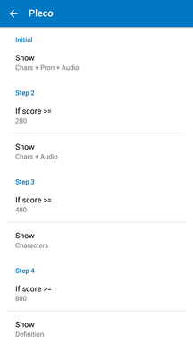
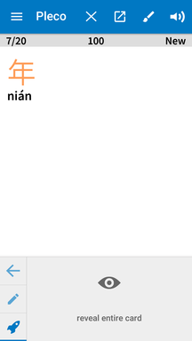
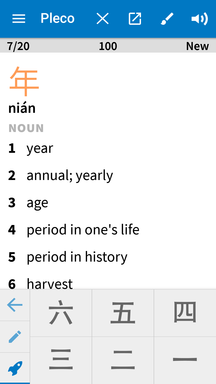
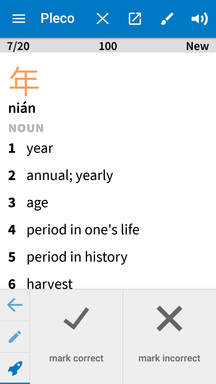
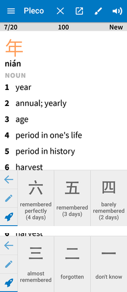
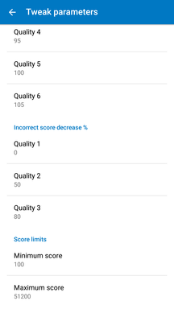

# Pleco flashcards

In this repository you can find per-lesson flashcards that can be used for the widespread 汉语教程 *Hanyu Jiaocheng* books as well as for the corresponding 汉语口语速成 *Short-term spoken Chinese* series (see the [flashcards](flashcards) directory for available card sets and their respective book editions).

The flashcards can be imported into Pleco using the `Import > Import Cards` function. Once imported you will see subcategories for the individual lessons, which allows you to only review the vocabulary for specific lessons, or to expand your test sets over time.

If you are not familiar with Pleco's flashcard system yet, be sure to continue reading on how to set up an ideal spaced repetition testing system.

## Spaced repetition with the Pleco flashcard system add-on

Spaced repetition is a highly efficient learning technique where the intervals between reviews of the same vocabulary items increase over time as you get more familiar with them. This technique maximises the learning effect per time spent reviewing. The best spaced repetition system I've encountered is that implemented by Anki, which also automatically switches the review *direction*: at the beginning you are shown an item in the target language and need to know what it means, as you become more familiar with the item the system will start to ask you to do the reverse task, showing you the translation and producing the word or sentence yourself. While the Anki system is great, creating and managing your own flashcards for it is tedious, whereas Pleco provides the ability to create a flashcard from a dictionary entry you are looking at with just a single tap so that, eventually, I found myself switching to reviewing and testing with Pleco's flashcards.

The free version of Pleco only comes with a very stupid flashcard testing system, so even though you can still use the flashcards from this repository using the *random card selection* option I highly recommend spending the 10$ on Pleco's *Flashcard System* add-on. The add-on is *highly* configurable which can be a bit overwhelming, but it also means that once configured properly, you can continue using the same setup for years. Below are some straightforward instructions for setting up a perfect spaced repetition setup with Pleco that mimic's Anki's system of continuously switching to harder tasks, from passive reading/listening over speaking to writing.

### Pleco flashcard Spaced Repetition configuration

The following guide covers all important configuration settings for a good spaced repetition testing system for (almost) daily usage. It should also work well if you don't study so frequently. Feel free to adjust any other options that you encounter in the menus to your own liking, detailed explanations of all the configuration options are available on the [Pleco website](http://iphone.pleco.com/manual/30200/flash.html).

#### 1. Select or create a Spaced Repetition profile

Access the flashcard system from the Pleco menu, under `Flashcards > New Test`. Pleco should already have created a basic spaced repetition testing profile, which you can select under `Profile`.

> If you don't see a *Spaced Repetition* profile to select from, create a new profile under `Manage Profiles` and call it *Spaced repetition* or something similar. When you go back to the `New Test` page, Pleco should already have selected your newly created profile. Under `Card selection > Card selection system` select `Repetition-spaced`, return to the main screen and continue with the remaining steps of this guide.

#### 2. Configure the test directions

Under `Test Settings > Subject selection` select `Score-based`

Now when you go back to the parent menu and go into `Configure score subjects` you can select which 'direction' your flashcard is tested on based on how well you know it already. The usual progression is from reading (i.e. knowing its meaning and its pronunciation based on seeing the character), to knowing its pronunciation based on its meaning/definition, to not only knowing the pronunciation but also being able to write the character.

A fully fledged, slow learning progression for beginners might therefore look like this:

- `Initial > Show: Chars + Pron + Audio`
- `Step 2 > Show: Chars + Audio`
- `Step 3 > Show: Characters`
- `Step 4 > Show: Definition`

The values in the `If score >=` fields I would leave as they are. I haven't really made use of more than 4 steps, so I just set all remaining `Step X > Show` fields to whatever is the "hardest" test direction.

> You can choose to show whatever subjects you find meaningful of course, for example if you want to practice listening you could select to only show the cards' `Audio` as the initial subject. As the number of cards you are tested on expands you will find that it becomes impossible to distinguish between the many words which have identical pronunciations so I have not found this very useful. If you specifically want to practice listening you are probably better off using dedicated apps for training individual sounds, and later to simply listen to lots of actual Chinese language content (such as podcasts).

#### 3. Limit number of new/unlearned cards

Under `Card selection`, make sure that `Card selection system` is set to `Repetition-spaced`. I highly recommend you tick `[X] Sort cards randomly`, and to *untick* `[ ] Prompt to continue`.

> Continuing to test yourself on cards that aren't due yet can be very tempting, because often you will find them to be much easier than the set of cards during your actual test that you had to struggle through with mixed success. But for the exact same reason testing yourself early is not actually that useful: non-due cards are easier because you have reviewed them more recently, meaning they are quite fresh in your memory. By testing yourself on them again early you are merely *cramming* in the short-term, which might not actually lead to long-term retention. When you get to the end of a test and Pleco tells you that *there are no more cards due for review right now*, rest assured in the knowledge that *you are actually making the most effective use of your learning time* by stopping to review those same cards. If you absolutely feel like studying more, you should probably increase your number of cards instead.

Still under `Card selection`, tick `[X] Limit new cards`. This is especially important if you are about to import a lot of cards, as otherwise Pleco will try to expose you to *all* of them during your very first test, which can be overwhelming. Whether you want to limit the number of cards by `maximum unlearned` or `new per day` depends on the situation, especially on whether you're currently aiming to learn a lot of new words, or if you are more interested in steadily retaining a slowly expanding but solid vocabulary. I sometimes find myself going back and changing this setting based on what my current goal is, but here are some rules of thumb:

- Limiting the number of cards based on `new per day` is only recommended if you have a strict study regime where you know how many new items you want to introduce on any given day you study. When you've just imported a lot of cards that you already know somewhat, it might feel easy to race through 50 new cards on a day, but in the long run I have found limiting `To` *between 5 and 10 new cards per day* to be sustainable.

- Limiting the number of cards based on `maximum unlearned` leads to a more conservative but also more adaptive and thorough review schedule, as it will stop Pleco from introducing new cards into the test set as long as you haven't sufficiently mastered the current ones. To decide when a `Card is learned` I suggest leaving the default `score >=` condition and setting the required `Amount` to the subject selection threshold value that you consider most crucial for your learning. If you use the subject selection regime I specified above and only consider a card 'learned' if you know how to pronounce and write it based on its definition, then you should put the corresponding threshold, which is `800`. Personally I'm happy to introduce new cards even if I don't know all of the present ones perfectly, so I normally put a value between `400` and `600`. The advantage of limiting by `maximum unlearned` is that your pool of cards adapts to how well you are currently doing, as opposed to whatever learning goal you set yourself in advance. Depending on your frustration threshold, you can limit the number of unlearned cards `To` *between 20 and 100 cards*.

> If you are importing a lot of flashcards that you already know well and you don't want to click through them all to get them over the 'learned' threshold, you can also set all their scores to a higher value on import (see below on [Managing cards](#managing-cards)).

#### 4. Configure prompting for recall quality

Under `Scoring` tick `[X] Prompt for recall quality`. Many flashcard testing systems will only judge you based on whether you chose the correct answer or not, but you can get a much better system by providing more fine-grained feedback on exactly how well you know a card. Instead of a simple correct/incorrect choice, this option will provide you with six possible answers during testing: *remembered perfectly* (6/六), *remembered* (5/五), *barely remembered* (4/四), *almost remembered* (3/三), *forgotten* (2/二) and *don’t know* (1/一).

The `Button layout` lets you choose how these 6 options are presented to you. The `654321` option displays them all at once as soon as you reveal the card (see screenshots below).

In contrast to the split options (like `321/654`, see screenshots below) this saves you one click per card, because you don't have to select 'correct' or 'incorrect' first before being shown the fine-grained qualities to choose from. One nerdy advantage of the split options is that when you select the `[X] Show SRS intervals` option (available on Android only), it also displays information on how your recall quality selection affects the time until the next review of the card, as shown in the rightmost screenshot:

##### 5. Adjust *almost remembered* and *forgotten* score parameters

Still in the `Scoring` menu, select `Tweak parameters`. Here you can fine-tune how the short-term *score* of the card as well as its long-term *easiness* level are updated based on how well you know the cards. The effects of the these settings are quite complex so it's best to leave them at their default values, with the exception of two fields which I suggest you change:

- Set `Incorrect score decrease % > Quality 2` to `50`
- Set `Incorrect score decrease % > Quality 3` to `80`

<!-- https://en.wikipedia.org/wiki/Leitner_system -->

Now you're good to go! Before starting your first test you might want to import some premade flashcards.

### Importing cards

Once you've downloaded your desired [flashcard wordlist](flashcards) onto your phone or tablet, go to `Import / Export > Import Cards`. After selecting the file under `Choose File`, hit `Begin Import`. Imported cards will automatically be organized in categories (and sub-categories), which you can browse under `Organize Cards`. Categories can also be assigned coloured *Tags* (which will show up on the Pleco dictionary entries) by long-pressing on them in the `Organize Cards` menu.

> I highly recommend you also import Pleco's premade flashcard sets for HSK levels 1 through 6, which you can download automatically under `Import / Export > Premade Cards`.

### Managing cards

Unless you're a complete beginner, you might have imported some card sets in categories (e.g. as Pleco's premade *HSK1* set) which are certainly not 'unlearned', but which are still useful to keep in the test set to review once in a while. To save yourself from needlessly frequent reviews of easy cards, and to push their score above the 'unlearned' threshold, you can manually set their score to some higher value:

> In the `Organize Cards` menu, open a category, then select `Edit` (top of the page), `Batch` (bottom of the page), and scroll down to `Change Score`. You can either `reset score to` some `Amount` greater than your specified 'learned' threshold, or else `randomly increase 
score by up to` that same amount. The advantage of the latter is that not all of the cards from the category will become 'due' at the exact same time in the future. Don't forget to hit `Change score now` to actually change the scores.

Another thing about using large numbers of imported cards is that you often don't want to be tested on *all* of your flashcards. This is especially true if you've imported Pleco's premade HSK flashcards as described above. To limit testing to cards from categories you are actually meant to be learning, simply select them under `Card categories` in the `New Test` menu.

> The [flashcards](flashcards) provided in this repository are organized in sub-categories for every individual lesson/chapter, which allows you to gradually expand your test set as you work your way through the books.

### Links

- [Pleco Forums thread on spaced repetition configuration](https://www.plecoforums.com/threads/how-to-learn-in-batches-with-srs.4413/page-2)
- [Edsko de Vries on studying different learning directions using different score files](http://www.edsko.net/2015/01/16/study-with-pleco/)
